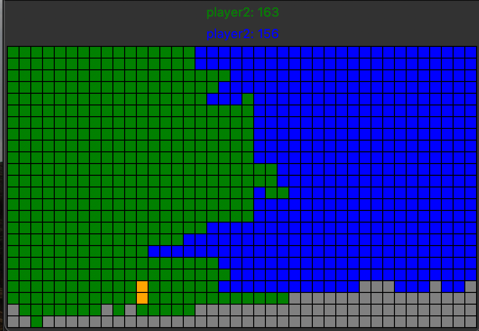

# fill_grid_with_pattern_bot
# Міні-проєкт №2. Створюємо ботів
Мета цього проєкту отримати додаткову практику програмування та розробки простих евристичних алгоритмів.

Завданням цього мініпроєкту є розроблення алгоритму програми, яка зможе грати у гру в автоматичному режимі. Іншими словами потрібно буде розробити програму-бот для гри.


Гра дуже проста. Прямокутне ігрове поле (дошку) необхідно заповнити фігурками таким чином, щоб залишити якнайменше пустих місць (згадайте, наприклад, тетріс). Гра зупиняється, якщо неможливо розмістити нову фігуру, або при розміщенні фігури були порушені правила.

Гра дуже цікава. Гра розрахована на двох гравців, які почергово виконують ходи - розмішують фігури на дошці. Мета гравця успішно розмістити на дошці максимальну кількість фігур та завадити супротивнику зробити те саме. У грі перемагає гравець який заповнив більше комірок дошки за свого супротивника.

Отже, для успішного виконання мініпроєкту потрібно написати програму, яка не тільки правильно розміщує фігури на ігровому полі, але й при розміщенні фігур використовує певний алгоритм (стратегію), який дозволяє отримати гору над супротивником (створює перепони для супротивника, який також хоче заповнити дошку своїми фігурам). Алгоритм також повинен протистояти алгоритму супротивника.
Хід гри

Гравці по черзі виконують ходи.

Гравець отримує поточний стан ігрового поля (`дошка`, `map`). `Дошка` - це прямокутне поле (таблиця), яка містить 3 види комірок: пусті, заповнені одним з гравців та комірки, які заповнив його супротивник.

На початку гри дошка містить тільки дві заповнені комірки.
```
.................
.................
.................
..O..............
.................
.................
.................
..............X..
.................
.................
```
Далі один з гравців отримує право ходу та фігуру, яку йому необхідно поставити на дошку. Фігури можуть бути різних розмірів  та форм й гравець дізнається розміри та форму фігури тільки перед виконанням ходу.
Задача гравця - поставити фігуру таким чином, щоб **одна (і лише одна)** її комірка перекривалася з будь-якою з попередньо заповнених гравцем комірок на дошці.
Фігура також не повинна виходити за межі дошки.

Після виконання ходу гравцем, хід переходить до його супротивника. Гра продовжується допоки гравець не зробить першу помилку. Помилка це стан коли неможливо зробити коректний хід (дошка заповнена), або гравець (алгоритм) не знаходить коректний хід (гравець не знаходить місце куди можна поставити фігуру, хоча фігуру можливо розмістити на дошці, або гравець робить хід що порушує правила).

Після першої помилки гравець "вибуває" з гри, й наступні ходи робитиме тільки його супротивник. Коли й супротивник зробить першу помилку, гра закінчується.

Переможець визначається за кількістю заповнених гравцем комірок. Наприклад, якщо після закінчення гри дошка має наступний вигляд, то переміг  гравець X, який заповнив 46 комірок.
```
..............OOX
.......OOOOOOOOOX
.OO...OOOOOOOOOOX
OOOOOOOOOXXXXXXXX
XOOOOOOOOXXXXXXXX
XXXXXXXXXXX...X..
XXXXXXXXXX....X..
...XX.........X..
.................
.................
```

### Дошка

Дошка у грі представляється наступним чином:
```
Plateau 15 17:
    01234567890123456
000 .................
001 .................
002 .................
003 .................
004 .................
005 .................
006 .................
007 .................
008 ..O..............
009 .................
010 .................
011 .................
012 ..............X..
013 .................
014 .................
```
Спершу вказано розміри дошки. Далі зображені комірки ігрового поля з координатами рядків й стовпців дошки.

Цей приклад показує дошку на початку гри й на дошці тільки стартові позиції гравців.

Після кількох ходів дошка може мати наступний вигляд:
```
Plateau 15 17:
    01234567890123456
000 .............OOOX
001 .............OOOX
002 ............OOOOX
003 ............OOOOX
004 .............ooOX
005 ..............OOX
006 .......OOOOOOOOOX
007 .OO...OOOOOOOOOOX
008 OOOOOOOOOXXXXXXXX
009 XOOOOOOOOXXXXXXXX
010 XXXXXXXXXXX...X..
011 XXXXXXXXXX....X..
012 ...XX.........X..
013 .................
014 .................
```
Маленькі літери показують комірки (координати, позиції), які були заповнені коли було поставлено останньою фігуру.

У грі є декілька дощок. Дошки відрізняються розмірами й програма повинна коректно працювати з дошкою будь-якого розміру. (Під час тестування програми може використовуватися нова дошка довільного розміру).
Фігури

Фігури у грі представляються наступним чином:
```
Piece 2 3:
..*
***
```
Спочатку вказано розмір фігури, а потім зображено її форму. Фігура може містити пусті комірки (точки).

Наступний приклад фігури демонструє, що розміри фігури та її форма це різні характеристики фігури й ці особливості потрібно буде враховувати при розробці програми.
```
Piece 4 5:
.**..
.***.
..*..
.....
```
## Віртуальна машина

Для запуску розробленої програми (боту) потрібно скористатися спеціальною програмою (віртуальною машиною гри), яка знаходиться у доданих файлах (файл filler_vm).

Запуск віртуальної машини

Віртуальна машина написана мовою програмування Ruby. Для роботи цієї програми потрібен інтерпретатор мови програмування Ruby, який необхідно встановити. З вказівками по встановленню інтерпретатора можна ознайомитись тут.

Віртуальна машина запускається з командного рядка.

Наприклад, наступний запуск віртуальної машини запускає гру на дошці `map00` й в гру грають два гравці `p1` та `р2`. В команді вказано імена гравців та шляхи до програм-ботів.
```Bash
./filler_vm -f ./map00 -p1 ./romanyuk.filler -p2 ./borkivskyi.filler
```
Команда
```Bash
./filler_vm --help
```
дозволяє дізнатися більше про взаємодію з віртуальною машиною.

Зверніть увагу, що віртуальна машина запускатиме програму не як
```Bash
python3 program.py
```
, а як
```Bash
./program.py
```
Через це використовуються shebang у першому рядку програми.

Увага: якщо у вас Windows, то запуск має бути:
```Bash
ruby ./filler_vm -f ./map00 -p1 "py ./player1.py" -p2 "py ./player1.py"
```
та замість py може бути інше ключове слово.

Якщо не вдається запустити віртуальну машину, або не працює програма-бот то можливо потрібно змінити атрибути відповідних файлів. Найпростіше зробити це в командному рядку за допомогою команди
```Bash
chmod u+x <ім'я файлу>
```

## Взаємодія з віртуальною машиною

Віртуальна машина запускає Вашу програму самостійно.

На кожному кроці гри віртуальна машина надсилає гравцю оновлену дошку та нову фігуру.

Гравець зчитує ці дані зі стандартного пристрою введення (функція `input()`).

Гравець записує у стандартний пристрій виведення (функція `print()`) координати розміщення фігури на дошці  - повертає хід у віртуальну машину.

Віртуальна машина надсилає дошку та нову фігуру іншому гравцю.


Віртуальна машина надсилає програмі - боту лише ту інформацію, що стосується вашого гравця.

* Інформація про номер вашого гравця.
* Дошка.
* Фігура.
* (Ваш хід).
* Повторюється пункт 2.

Приклад перших декількох ходів (ітерацій) гри наведено у файлі `sample_input.txt` в доданих файлах. Потрібно звернути увагу на рядок `<got (X): [12, 14]`, який містить інформацію про хід, який зробив гравець.

Якщо хочете побачити візуалізацію гри, то можете додатково запустити візуалізатор:
```Bash
./filler_vm -f ./map01 -p1 ./player1.py -p2 ./player1.py | python3 visualizer.py
```


## Створення власного бота

Для початку роботи над власним алгоритмом та його реалізацією вартує ознайомитися з модулем player1.py який є прикладом простого бота, який, втім, здатний коректно взаємодіяти з віртуальною машиною.
### Поради:

* Подумайте про способи зневадження програми. Цього разу не вийде скористатися функцією print() для зневадження, використовувати зневаджувач (дебагер) буде також складено, ба навіть запуск програми тепер виконує інша програма.
* Використовуйте власного бота для запуску гри. Також можна розробити два боти й влаштувати змагання між ними.
* Спробуйте змагатися із ботами одногрупників. (Частину оцінки буде виставлено на основі результатів змагань з іншими ботами, тож може бути корисно оцінити свої сили до оцінювання).
* Для захисту свого алгоритму під час змагань з іншими ботами можна скористатись сервісами для обфускації коду. В такому випадку не можна буде переглянути Ваш код, а отже й дізнатися як працює Ваш алгоритм.


## Вимоги до програми

* Програма повинна працювати коректно. В разі, якщо фігуру можливо поставити, програма повинна це зробити.

* При роботі програми не повинні виникати помилки виконання (Run Time Error)

* Програма не повинна повертати некоректне значення в разі, якщо можливо поставити фігурку коректно.

* Перевіряти (валідувати) вхідні дані від віртуальної машини не треба, припускається, що вона завжди працюватиме коректно.


## Результати виконання мініпроєкту

Результати виконання мініпроєкту повинні бути розміщені у LMS до завершення граничного терміну.

Результати виконання мініпроєкту це один, або більше Python модулів та один PDF файл. Модулі містять Вашу програму, PDF фалі містить опис Вашого алгоритму. Без опису алгоритму робота вважається зданою на 0 балів.

Шаблони назви файлів наступні:
```
player_Прізвище_Ім'я.py

algorithm_Прізвище_Ім'я.pdf
```

## Оцінювання

### Результати виконання мініпроєкту будуть оцінені наступним чином:

1. 3 бали за те, що бот ставить фігурки відносно до кінця (формально можна сказати що бот завжди закриває більшу частину поля, якщо грає сам з собою). Ми сподіваємось, що всі зроблять наступну вимогу.

1. Ще 3 бали за те, що бот ставить фігурки завжди, коли це можливо

1. Ще 5 балів за змагання між ботами студентів. Попередньо це буде схоже на лідерборд з 1-го проєкту.

Не забувайте про академічну доброчесність - в разі виявлення плагіату роботи будуть оцінені в 0 балів (так, у нас є роботи за останні кілька років).